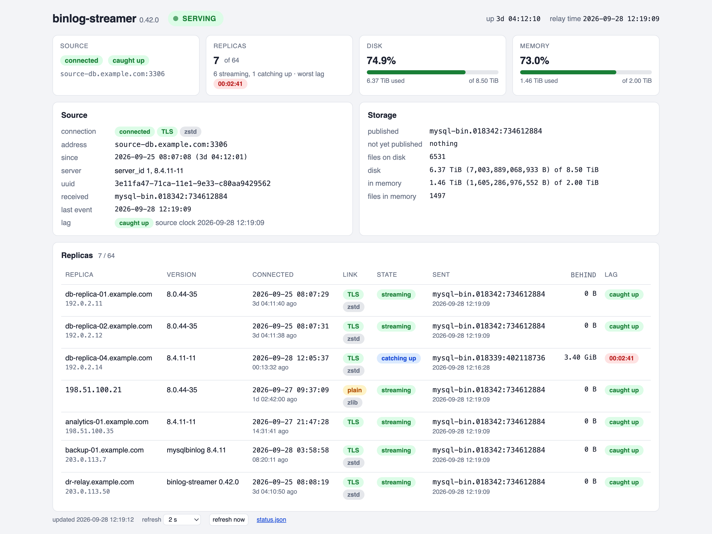

# Binlog Streamer

A relay for MySQL replication. It receives the binary log from one MySQL or
Percona Server source (8.0 and newer), keeps it for a configured period and
serves it to many replicas, so the source carries one replication connection
instead of one per replica.

## Quick start

Build and install the Debian/Ubuntu package:

```sh
git clone --recurse-submodules https://github.com/abychko/binlog-streamer.git
cmake -S binlog-streamer -B build -DCMAKE_BUILD_TYPE=Release
cmake --build build && (cd build && cpack -G DEB)
sudo apt install ./build/binlog-streamer_*.deb
```

Name the source in `source.yml` and the replicas' accounts and addresses in
`replica.yml`, check the configuration and start the service:

```sh
sudoedit /etc/binlog-streamer/source.yml
sudoedit /etc/binlog-streamer/replica.yml
sudo -u binlog-streamer binlog-streamer --validate-config
sudo systemctl enable --now binlog-streamer
```

Point a replica at the relay as at any source, with GTID auto-positioning.
Its `gtid_executed` has to contain the relay's `@@GLOBAL.gtid_purged`.

```sql
CHANGE REPLICATION SOURCE TO SOURCE_HOST = '<relay>', SOURCE_PORT = 3307,
  SOURCE_USER = '<user>', SOURCE_PASSWORD = '<password>', SOURCE_AUTO_POSITION = 1;
START REPLICA;
```

## Build

Requirements: CMake 3.20+, a C++20 compiler, Perl and make (to build the
bundled OpenSSL), GoogleTest for tests.

```sh
cmake -S binlog-streamer -B build
cmake --build build
ctest --test-dir build
```

The Debian package is built on Debian and Ubuntu (`BUILD_DEB`, on by default
there) and is the only package the build produces.

## Configuration

The package installs three files to `/etc/binlog-streamer/`:

- [`settings.yml`](packaging/settings.yml): server id and connection limit,
  storage and retention, memory cache, monitoring;
- [`source.yml`](packaging/source.yml): the source connection, its
  compression and TLS;
- [`replica.yml`](packaging/replica.yml): the listening address (port 3307
  by default), replica accounts and hosts, compression and TLS offered to
  replicas.

Service options go to
[`/etc/default/binlog-streamer`](packaging/default/binlog-streamer); command
line options are listed by `binlog-streamer --help`.

The configuration is checked on every start, restart and reload, and the
relay does not start with one it rejects. `systemctl reload` applies new
`hosts` of configured replica users and keeps the running configuration if
the new one is invalid; other changes need a restart. A restart stops the
relay before reading the new configuration, so check it first:

```sh
sudo -u binlog-streamer binlog-streamer --validate-config &&
  sudo systemctl restart binlog-streamer
```

## Monitoring

The relay's state is served over HTTP on port 8080 (`monitoring.http` in
`settings.yml`): `/status.json` for machines, `/` as a page. There is no
TLS or authentication; bind the port to loopback or put it behind a reverse
proxy that adds them.

<a href="doc/img/monitoring.png"></a>

```sh
curl -s http://localhost:8080/status.json
```

A Zabbix template,
[`packaging/zabbix/binlog-streamer.yaml`](packaging/zabbix/binlog-streamer.yaml),
is installed under `/usr/share/doc/binlog-streamer/zabbix/`.

## License

GNU General Public License, version 2.0, with a permission to link with
separately licensed software such as OpenSSL: see [`LICENSE`](LICENSE) and
the header of any source file.
